# 👨‍💻 Nathan Liu

### Software Developer | Cloud Architect | Performance Enthusiast

---

### 🚀 About

Building **scalable logistics solutions** at **J&J Global Fulfilment**. Passionate about cloud architecture, high-performance systems, and crafting elegant code. Former **BlackRock** intern and **Top Rated** UpWork developer.

### 💎 Tech Arsenal

### 📊 Journey

```mermaid
graph LR
    A[🎓 UCL] --> B[🏢 BlackRock]
    B --> C[💼 UpWork Top Rated]
    C --> D[☁️ Cloud Engineer]
    D --> E[🚀 Lead Developer]
```

**Current:** Software Developer / App Support Lead @ J&J Global Fulfilment
**Education:** MSc Advanced CS (Oxford Brookes) • BSc CS (UCL)
**Fun Fact:** Completed a 100-mile ultramarathon 🏃‍♂️

---

### ✨ Let's Build Something Amazing

*Open to collaborations and interesting challenges*

